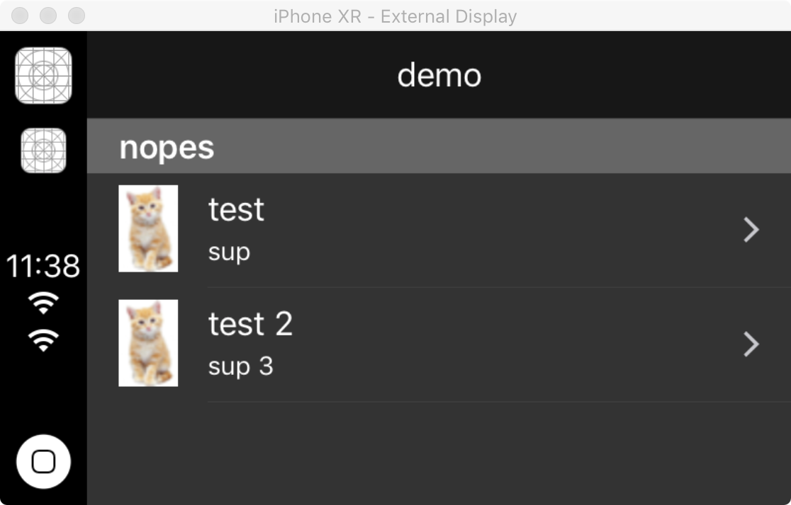
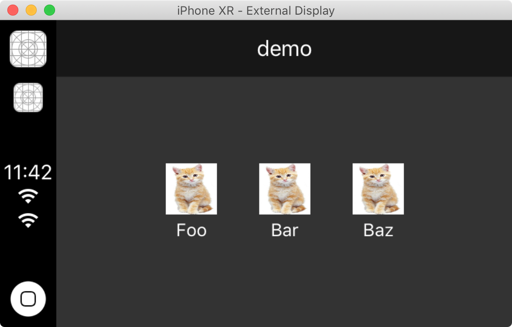
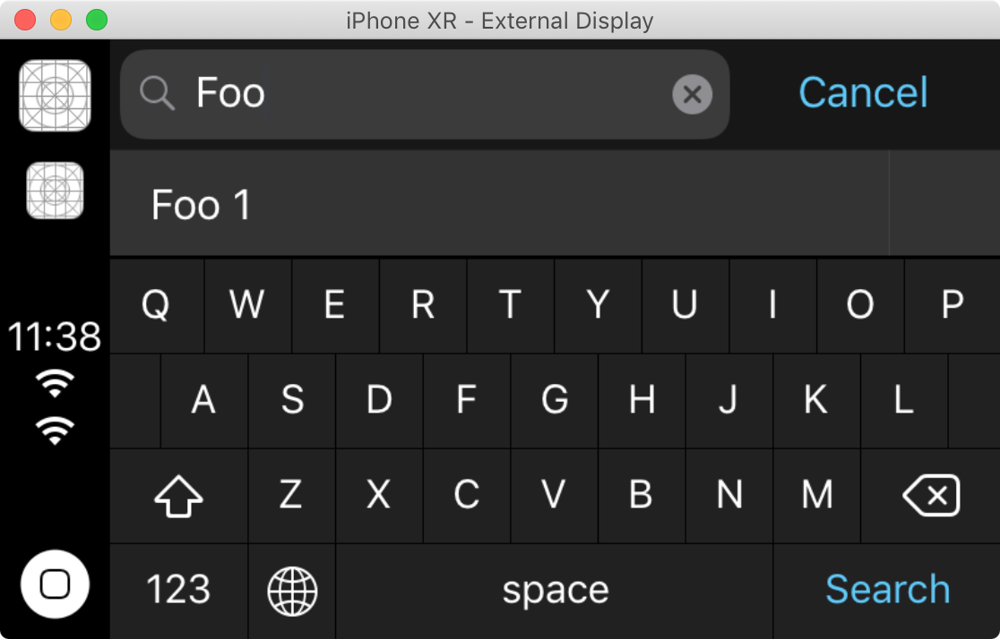

# CarPlay with React Native

What if you could create CarPlay with React Native. Well, now you can.








## CarPlay Entitlement and XCode Project Setup

#### Read this section if you are new to CarPlay!

One of the most useful resources for undertanding the requirements, constraints and capabilities of CarPlay apps is the official [App Programming Guidelines](https://developer.apple.com/carplay/documentation/CarPlay-App-Programming-Guide.pdf) from Apple. It's a 50-page document that clearly lays out steps required and you are strongly encouraged to read it if you are new to CarPlay.

*You can develop CarPlay capabilities with this project without waiting for Apple to send you back an entitlement, through the simulator.* 

If you want to build and run your app on an iPhone or share it with others through the App Store Connect or TestFlight, you will need to request a CarPlay entitlement from Apple first. The process will take anywhere from a few days to weeks - your mileage will vary. This depends on the type of Entitlement you are requesting. If you are part of the MFi program, this may help speed things up too. You then need to add the entitlement to your privisioning profile or signing certificate that you use for signing your app in XCode.

You can go to [this Apple CarPlay entitlement request page](https://developer.apple.com/contact/carplay/) to request a CarPlay Entitlement. You need to be logged in with an Apple Developer account.

To start a CarPlay simulator in XCode, within the Simulator window, go to the menu option IO, click on External Displays, then select CarPlay.

#### NB:
Whether you are running through a simulator or building the app for distribution, you need to ensure that the correct entitlement key is added in your `Entitlements.plist` file. If you don't have an Entitlements.plist file, create one in your `iOS/` directory.

## Installing

1. Install the library

```bash
yarn add react-native-carplay --save
```

2. Link using normal or cocoapods method
```bash
react-native link react-native-carplay
```
```ruby
# in ios/Podfile:

pod 'react-native-carplay', path: '../node_modules/react-native-carplay'
```

3. Edit your AppDelegate


```objc
// AppDelegate.h

// [step 1] add this line to the top
#import <CarPlay/CarPlay.h>

// [step 2] add the "CPApplicationDelegate" to the end, before ">":
@interface AppDelegate : UIResponder <UIApplicationDelegate, CPApplicationDelegate>
```

```objc
// AppDelegate.m

// [step 1] add this line to the top
#import <RNCarPlay.h>

// ...

// [step 2] add the following two methods before @end

- (void)application:(UIApplication *)application didConnectCarInterfaceController:(CPInterfaceController *)interfaceController toWindow:(CPWindow *)window {
  [RNCarPlay connectWithInterfaceController:interfaceController window:window];
}

- (void)application:(nonnull UIApplication *)application didDisconnectCarInterfaceController:(nonnull CPInterfaceController *)interfaceController fromWindow:(nonnull CPWindow *)window {
  [RNCarPlay disconnect];
}

@end
```

## Usage

[See full example](https://github.com/birkir/react-native-carplay/blob/master/example/src/App.tsx)

```jsx
import { CarPlay, GridTemplate } from 'react-native-carplay';

const template = new GridTemplate();

CarPlay.setRootTemplate(template);
```

### setRootTemplate

Sets the root template of CarPlay.

This must be called before running any other CarPlay commands. Can be called multiple times.

```tsx
CarPlay.setRootTemplate(template, /* animated */ false);
```

### pushTemplate

Pushes a new template to the navigation stack.

**Note** you cannot push the same template twice.

(where `template` is one of GridTemplate, ListTemplate or SearchTemplate)

```tsx
CarPlay.pushTemplate(template, /* animated */ true);
```

### popTemplate

Pop currently presented template from the stack.

```tsx
CarPlay.popTemplate(/* animated */ false);
```

### popToTemplate

Pop currently presented template from the stack to a specific template. The template must be in the stack.

```tsx
CarPlay.popToTemplate(template, /* animated */ false);
```

### popToRoot

Pop the stack to root template.

```tsx
CarPlay.popToRoot(/* animated */ false);
```

## Example

### MapTemplate

```jsx
import { CarPlay, MapTemplate } from 'react-native-carplay';

function CarPlayView() {
  return (
    <View>
      <Image style={{ width: 100, height: 100 }} />
      <Text>My thing</Text>
      <GoogleMap />
    </View>
  );
}

const map = new MapTemplate({
  guidanceBackgroundColor: '#aeafaf',
  component: CarPlayView,
  mapButtons: [{
    id: 'test',
    image: require('assets/images/test.png'),
    focusedImage: require('assets/images/test-focused.png'),
  }]
});

CarPlay.setRootTemplate(map);
```

### ListTemplate

```jsx
import { CarPlay, ListTemplate } from 'react-native-carplay';

// Register a new template in memory
const artists = new ListTemplate({
  title: 'List of artists',
  leadingNavigationBarButtons: [{
    id: 'play',
    type: 'text',
    title: 'Play',
  }],
  sections: [{
    items: [{
      text: 'AC/DC'
      detailText: 'Rock',
      image: require('./artists/ac-dc.png'),
      showsDisclosureIndicator: true,
    }],
  }],
  onItemSelect(item) {
    const artist = new ListTemplate({
      title: 'AC/DC',
      sections: [...],
    });

    CarPlay.pushTemplate(artist, true);
  }
});

CarPlay.setRootTemplate(songs, false);
```

## Progress

### UI Elements

- [x] CPListTemplate
- [x] CPGridTemplate
- [x] CPSearchTemplate
- [x] CPMapTemplate
- [x] CPVoiceControlTemplate
- [x] CPAlertTemplate
- [x] CPActionSheetTemplate

### Route Guidance

- [x] CPNavigationSession
- [x] CPTrip
- [x] CPManeuver

### Other

- [x] CPAlertAction
- [ ] CPSessionConfiguration

### Methods

- [x] setRootTemplate
- [x] pushTemplate
- [x] popTemplate
- [x] popToTemplate
- [x] presentTemplate
- [x] dismissTemplate
- [x] updateListTemplateSections
- [x] reactToUpdatedSearchText
- [x] reactToSelectedResult

### Getters

- [ ] topTemplate
- [ ] rootTemplate

### Events

- [x] didConnect
- [x] didDisconnect
- [x] didSelectListItem
- [x] selectedResult
- [x] gridButtonPressed
- [x] updatedSearchText
- [x] searchButtonPressed
- [x] barButtonPressed
