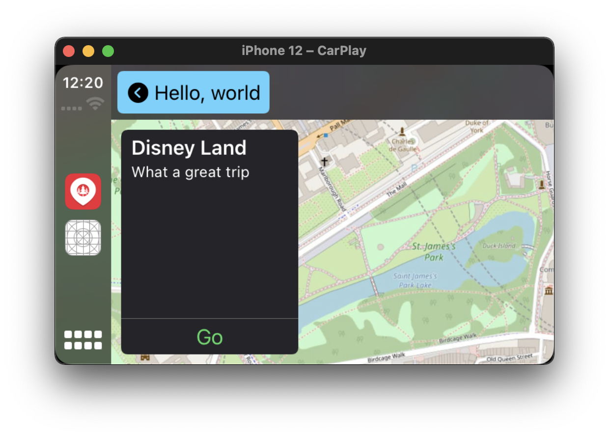
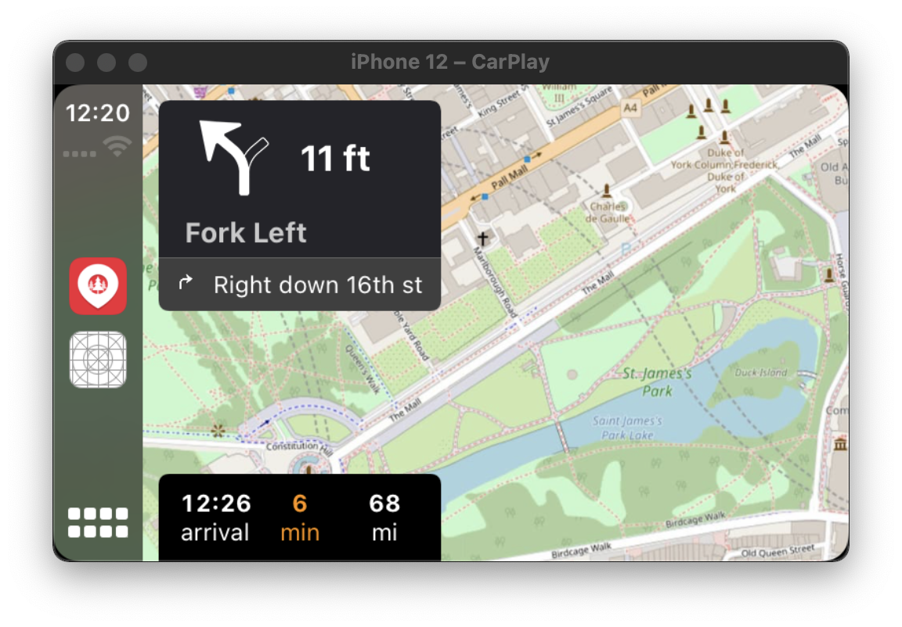
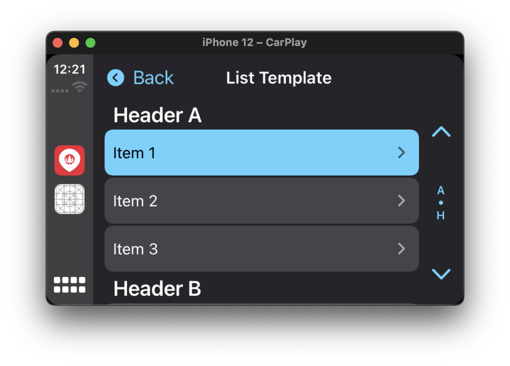
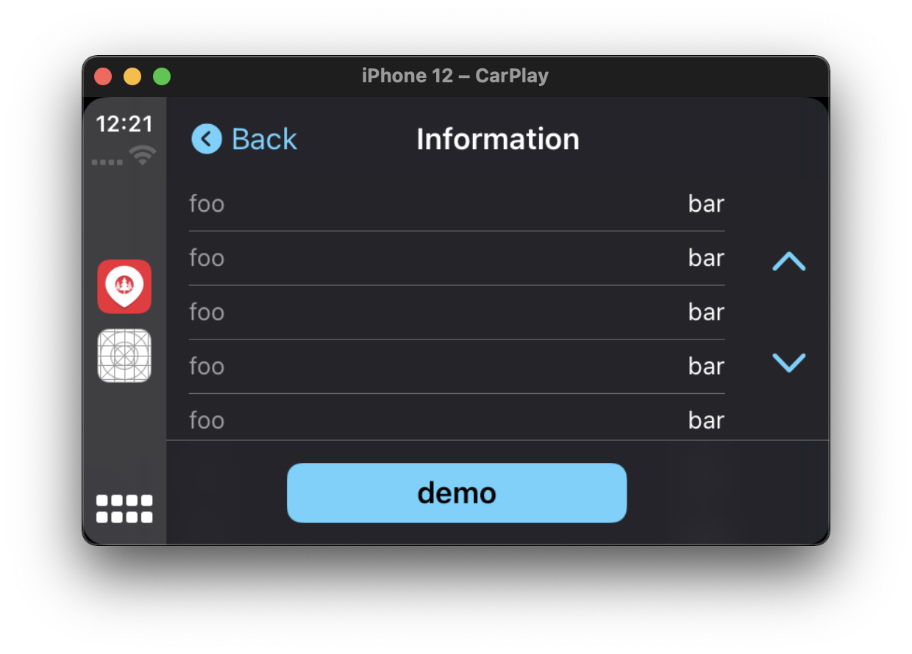
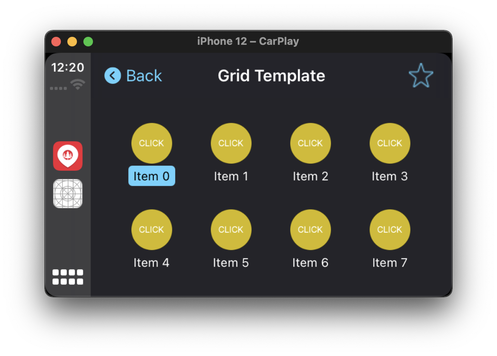
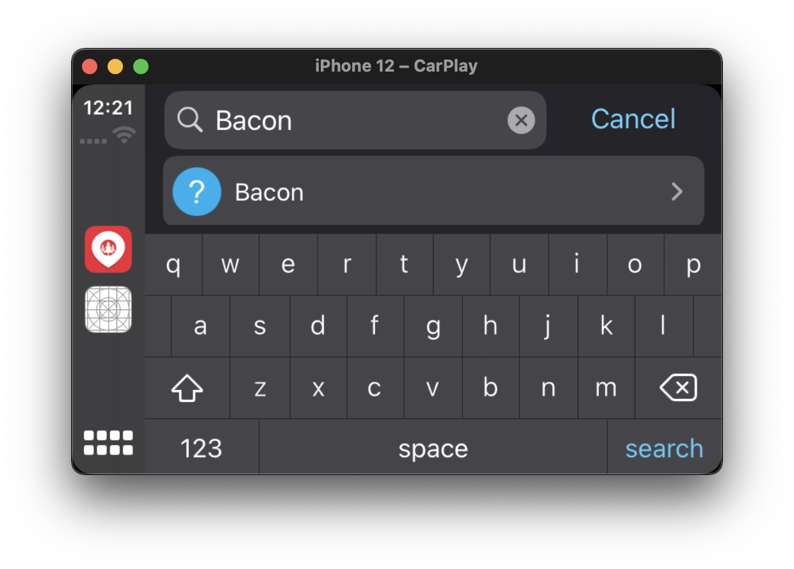
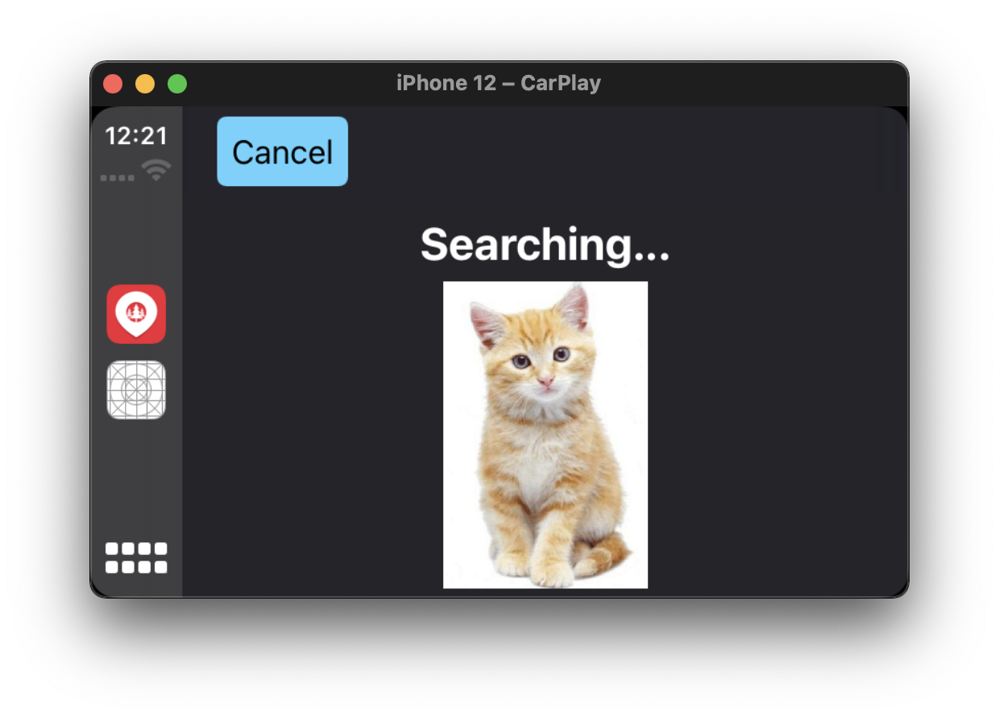
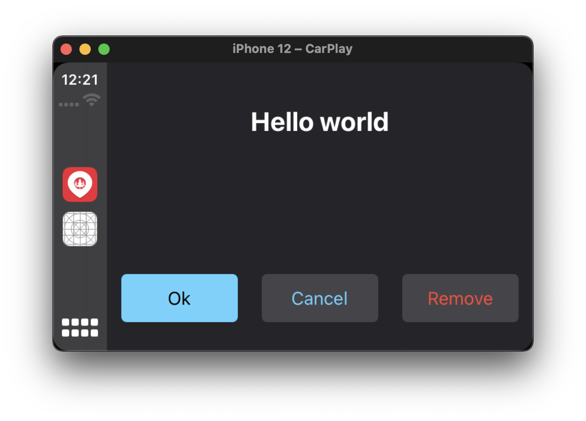
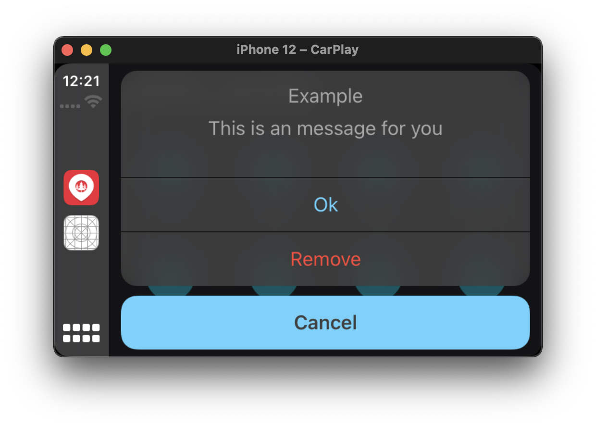
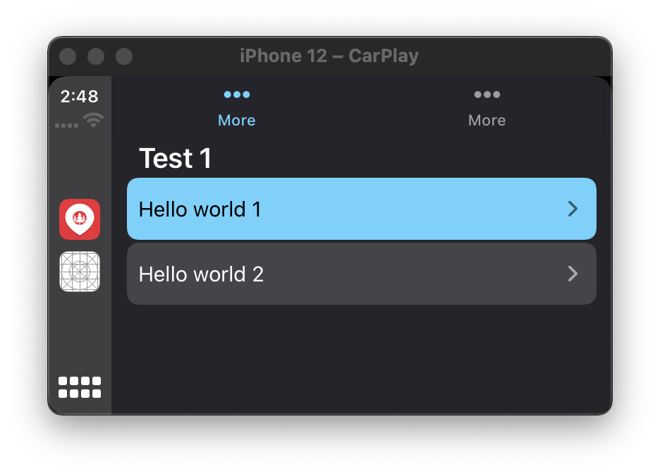

# CarPlay with React Native

What if you could create CarPlay with React Native. Well, now you can.


## Discord Channel

Come join us on our discord channel: https://discord.gg/b235pv6QHM

## Support

This version of `react-native-carplay` supports iOS 14. If you need support for versions before this please refer to version 1.3.1 of this package.

## CarPlay Entitlement and XCode Project Setup

#### Read this section if you are new to CarPlay!

One of the most useful resources for undertanding the requirements, constraints and capabilities of CarPlay apps is the official [App Programming Guidelines](https://developer.apple.com/carplay/documentation/CarPlay-App-Programming-Guide.pdf) from Apple. It's a 50-page document that clearly lays out steps required and you are strongly encouraged to read it if you are new to CarPlay. Further to the above guide, when developing a CarPlay app or if contributing to this package; you'll find the [CarPlay Documentation](https://developer.apple.com/documentation/carplay?language=objc) invaluable.

_You can develop CarPlay capabilities with this project without waiting for Apple to send you back an entitlement, through the simulator._

If you want to build and run your app on an iPhone or share it with others through the App Store Connect or TestFlight, you will need to request a CarPlay entitlement from Apple first. The process will take anywhere from a few days to weeks - your mileage will vary. This depends on the type of Entitlement you are requesting. If you are part of the MFi program, this may help speed things up too. You then need to add the entitlement to your provisioning profile or signing certificate that you use for signing your app in XCode.

You can go to [this Apple CarPlay entitlement request page](https://developer.apple.com/contact/carplay/) to request a CarPlay Entitlement. You need to be logged in with an Apple Developer account.

To start a CarPlay simulator in XCode, within the Simulator window, go to the menu option IO, click on External Displays, then select CarPlay.

#### NB:

Whether you are running through a simulator or building the app for distribution, you need to ensure that the correct entitlement key is added in your `Entitlements.plist` file. If you don't have an Entitlements.plist file, create one in your `iOS/` directory.

## Installing

1. Install the library

```bash
yarn add react-native-carplay --save
```

2. Link using normal or cocoapods method

```bash
react-native link react-native-carplay
```

```ruby
# in ios/Podfile:

pod 'react-native-carplay', path: '../node_modules/react-native-carplay'
```

3. Edit your AppDelegate

```objc
// AppDelegate.h

// [step 1] add this line to the top
#import <CarPlay/CarPlay.h>

// [step 2] add the "CPApplicationDelegate" to the end, before ">":
@interface AppDelegate : UIResponder <UIApplicationDelegate, CPApplicationDelegate>
```

```objc
// AppDelegate.m

// [step 1] add this line to the top
#import <RNCarPlay.h>

// ...

// [step 2] add the following two methods before @end

- (void)application:(UIApplication *)application didConnectCarInterfaceController:(CPInterfaceController *)interfaceController toWindow:(CPWindow *)window {
  [RNCarPlay connectWithInterfaceController:interfaceController window:window];
}

- (void)application:(nonnull UIApplication *)application didDisconnectCarInterfaceController:(nonnull CPInterfaceController *)interfaceController fromWindow:(nonnull CPWindow *)window {
  [RNCarPlay disconnect];
}

@end
```

## Basic Usage

[See full example](https://github.com/birkir/react-native-carplay/blob/master/example/src/App.tsx)

The exported `CarPlay` class gives you the API needed to add / remove templates from the CarPlay view hierarchy.

```jsx
import { CarPlay, GridTemplate } from 'react-native-carplay';

const template = new GridTemplate({
  title: 'Hello, World',
  buttons: [],
});

CarPlay.setRootTemplate(template);
```

## Connect / Disconnect

When working with CarPlay it is important to detect and respond to the connect / disconnect events. The CarPlay class provides both a `connected` boolean and an on connect / disconnect event you can register a callback to.

When you are creating and displaying a template within your existing app screens you may want to ensure CarPlay is connected before calling any carplay apis. This can be done within a `useEffect`.

```jsx
useEffect(() => {
  function onConnect() {
    // Do things now that carplay is connected
  }

  function onDisconnect() {
    // Do things now that carplay is disconnected
  }

  CarPlay.registerOnConnect(onConnect);
  CarPlay.registerOnDisconnect(onDisconnect);

  return () => {
    CarPlay.unregisterOnConnect(onConnect);
    CarPlay.unregisterOnDisconnect(onDisconnect);
  };
});
```

## CarPlay API

### CarPlay.setRootTemplate

Sets the root template of CarPlay.
This must be called before running any other CarPlay commands. Can be called multiple times.

```tsx
CarPlay.setRootTemplate(template, /* animated */ false);
```

### CarPlay.pushTemplate

Pushes a new template to the navigation stack.
**Note** you cannot push the same template twice.

```tsx
CarPlay.pushTemplate(template, /* animated */ true);
```

### CarPlay.popTemplate

Pop currently presented template from the stack.

```tsx
CarPlay.popTemplate(/* animated */ false);
```

### CarPlay.popToTemplate

Pop currently presented template from the stack to a specific template. The template must be in the stack.

```tsx
CarPlay.popToTemplate(template, /* animated */ false);
```

### CarPlay.popToRoot

Pop the stack to root template.

```tsx
CarPlay.popToRoot(/* animated */ false);
```

## Templates

Templates are used to render contents on the CarPlay screen from your app. Details of the templates supported by apple can be found in the [developer guide](https://developer.apple.com/carplay/documentation/CarPlay-App-Programming-Guide.pdf)

### MapTemplate




```jsx
import { CarPlay } from 'react-native-carplay';

const mapTemplate = new MapTemplate({
  component: /* react native view */ MapView,
  onAlertActionPressed(e) {
    console.log(e);
  },
  onStartedTrip({ tripId, routeIndex }) {
    // start your navigation code
    onStartNavigation(routeIndex);
  },
});

CarPlay.setRootTemplate(mapTemplate);
```

### ListTemplate



```jsx
import { CarPlay } from 'react-native-carplay';

const listTemplate = new ListTemplate({
  sections: [],
  title: 'List Template',
  async onItemSelect({ index }) {
    // use the selected index
    setSelected(index);
  },
});

CarPlay.pushTemplate(listTemplate, true);
```

### InformationTemplate



```jsx
import { CarPlay } from 'react-native-carplay';

const informationTemplate = new InformationTemplate({
  title: 'Information',
  items: [],
  actions: [{ id: 'x', title: 'demo' }],
  onActionButtonPressed({ id }) {
    // id of button pressed
    console.log('pressed', id);
  },
});

CarPlay.pushTemplate(informationTemplate);
```

### GridTemplate



```jsx
import { CarPlay } from 'react-native-carplay';

const gridTemplate = new GridTemplate({
  trailingNavigationBarButtons: [],
  buttons: [
    {
      id: 'List',
      titleVariants: ['List'],
      image: listImage,
    },
    {
      id: 'Grid',
      titleVariants: ['Grid'],
      image: gridImage,
    },
  ],
  title: 'Grid Template',
  onButtonPressed({ id }) {
    // id of button pressed
    setSelected(id);
  },
  onBarButtonPressed({ id }) {
    // id of bar button pressed
    setSelected(id);
  },
});

CarPlay.pushTemplate(gridTemplate, true);
```

### SearchTemplate



```jsx
const searchTemplate = new SearchTemplate({
  async onSearch(query) {
    // use the query to search
    // and return item array
    return performSearch(query);
  },
  async onItemSelect({ index }) {
    // index of the selected item
    setSelected(index);
  },
  onSearchButtonPressed() {
    // on search button pressed, should display
    // list template with results
    navigation.navigate('List');
  },
});

CarPlay.pushTemplate(searchTemplate, true);
```

### VoiceTemplate



This template is presented via `CarPlay.presentTemplate`. In order to implement voice recognition, take a look at the [`@react-native-voice/voice`](https://github.com/react-native-voice/voice) package.

```jsx
const voiceControlTemplate = new VoiceControlTemplate({
  // pass the control states
  voiceControlStates: [
    {
      identifier: 'TEST',
      image: require('../images/cat.jpg'),
      repeats: true,
      titleVariants: ['Searching...'],
    },
  ],
});

CarPlay.presentTemplate(voiceControlTemplate, true);
```

### AlertTemplate



This template is presented via `CarPlay.presentTemplate`.

```jsx
const alertTemplate = new AlertTemplate({
  titleVariants: ['Hello world'],
  actions: [
    {
      id: 'ok',
      title: 'Ok',
    },
    {
      id: 'remove',
      title: 'Remove',
      style: 'destructive',
    },
  ],
  onActionButtonPressed({ id }) {
    // id of the pressed button
    if (id === 'remove') {
      // presentable templates can be
      // dismissed
      CarPlay.dismissTemplate();
    }
  },
});

CarPlay.presentTemplate(alertTemplate);
```

### ActionSheetTemplate



This template is presented via `CarPlay.presentTemplate`.

```jsx
const actionSheetTemplate = new ActionSheetTemplate({
  title: 'Example',
  message: 'This is an message for you',
  actions: [
    {
      id: 'ok',
      title: 'Ok',
    },
    {
      id: 'remove',
      title: 'Remove',
      style: 'destructive',
    },
  ],
  onActionButtonPressed({ id }) {
    // the id of the button pressed
  },
});

CarPlay.presentTemplate(actionSheetTemplate);
```

### TabTemplate



This template must be set as the root template and cannot be pushed on top of other templates.

```jsx
const template1 = new ListTemplate({
  sections: [
    {
      header: 'Test 1',
      items: [{ text: 'Hello world 1' }],
    },
  ],
  title: 'AA',
});
const template2 = new ListTemplate({
  sections: [
    {
      header: 'Test 2',
      items: [{ text: 'Hello world 3' }],
    },
  ],
  title: 'BB',
});

const tabBarTemplate = new TabBarTemplate({
  templates: [template1, template2],
  onTemplateSelect(e: any) {
    console.log('selected', e);
  },
});

CarPlay.setRootTemplate(tabBarTemplate);
```

## Example App

A working example app can be found [here](https://github.com/birkir/react-native-carplay/blob/master/example/src/App.tsx).

To run it you must first install dependencies and pods.

1. install dependencies and build `react-native-carplay`

```bash
yarn install
```

2. move to example dir and install dependencies

```bash
cd example
yarn install
```

3. run build dev in root dir, this will copy the output to the examples node modules.

```base
cd ..
yarn build:dev
```

4. install pods in example app and start the metro bundler

```base
cd example/ios
pod install
yarn start
```

5. start xcode and run the project on your simulator or device

## Image Size and Resolution

Quirks observed where PNG image resolutions should be specfied with scale factor of 3.0 (i.e. append with `@3x`) with ListTemplate image sizing suggested around 80 x 80 px per [Issue #6](https://github.com/birkir/react-native-carplay/issues/6)

## Not working / In progress

### UI Elements

- [ ] Contact Template
- [ ] Now Playing Template
- [ ] Point of Interest Template

### Getters

- [ ] topTemplate
- [ ] rootTemplate
